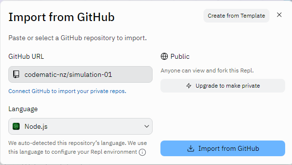

# Simulation 01 - Trading Simulator

The purpose of this web application is to provide a simple solution that can be used for simulations such as development or test automation.

 

## Technologies
- React
- Vite
- TypeScript

 

## Running on Repl.it
1. Login to Repl.it https://replit.com  (create an account if you don't have one)
2. Click `Create New Repl`
3. Click `Import from GitHub`
4. Paste in this repo URL into `GitHub URL`
5. Select the Language of `Node.js`
6. Finally click on the `Import from GitHub` button

e.g.

 

## Setting up Playwright

### Follow these steps to get setup within VS Code:
- Install VS Code from https://code.visualstudio.com/download
- Make sure you have the latest Node LTS installed from https://nodejs.org/en/download
- run `npm init playwright@latest` from a terminal

See https://playwright.dev/ for more detailed and up to date information.

## Running locally

`npm run dev`

